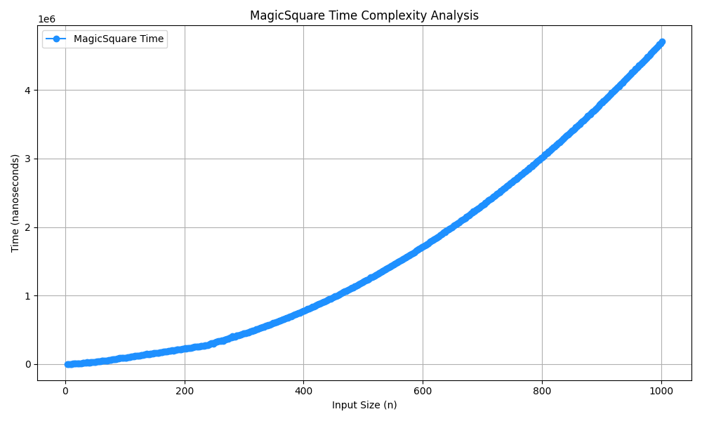

- A magic square is a square grid of distinct numbers arranged in such a way that the sum of numbers in each row, each column, and both main diagonals is the same. This constant sum is called the magic constant or magic sum.

## Steps:

- 1.Start with an empty 3×3 grid.

- 2.Place the number 1 in the middle column of the first row.

- 3.Move up and to the right to place the next number.

- 4.If this move takes you out of the grid, wrap around to the opposite side (top to bottom or right to left).

- 5.If the cell is already filled, move one step down instead and place the number there.

- 6.Repeat this process until all numbers from 1 to 9 are placed.

## Time complexity:O(n^2)

