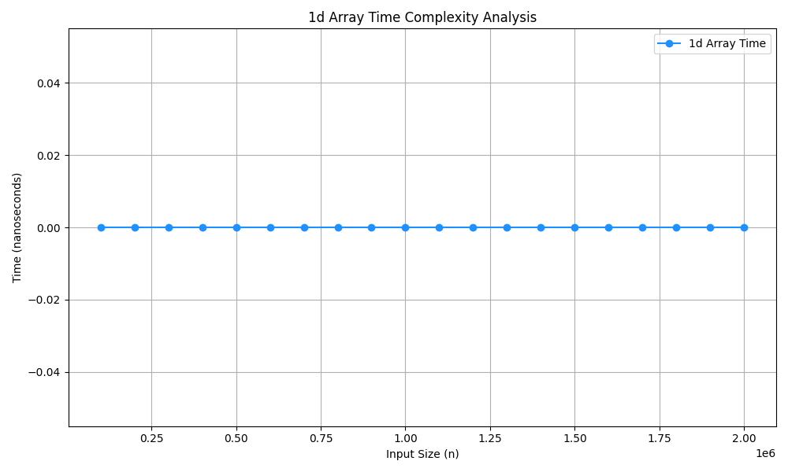
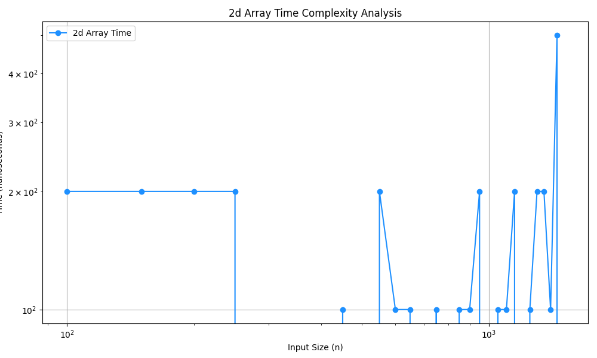

## 1D Array Peak element
A peak element in a 1D array is an element that is greater than or equal to its neighbors.

# Steps:

- 1.Start with two pointers: low = 0 and high = n - 1.

- 2.While low is less than or equal to high, find the middle index: mid = (low + high) // 2.

- 3.Check if the middle element is a peak:

It's a peak if it's greater than or equal to both its neighbors.

Be careful with boundary cases: for the first and last elements, only one neighbor exists.

- 4.If the left neighbor is greater than arr[mid], then a peak must exist in the left half, so move high = mid - 1.

- 5.Else if the right neighbor is greater, move to the right half by setting low = mid + 1.

- 6.Continue this process until a peak is found.

# Time Complexity:O(log n) (Efficient Approach)

## 2d Array Peak elements

# Steps:
- Given a 2D Array/Matrix mat[][], the task is to find the Peak element.

- An element is a peak element if it is greater than or equal to its four neighbors, left, right, top and bottom. 

- A peak element is not necessarily the overall maximal element. It only needs to be greater than existing adjacent 
More than one such element can exist.  We need to return any of them
- There is always a peak element. 
- For corner elements, missing neighbors are considered of negative infinite value. 

# Time Complexity:
- O(rows * log(columns)). We recur for half the number of columns. In every recursive call, we linearly search for the maximum in the current mid column.

