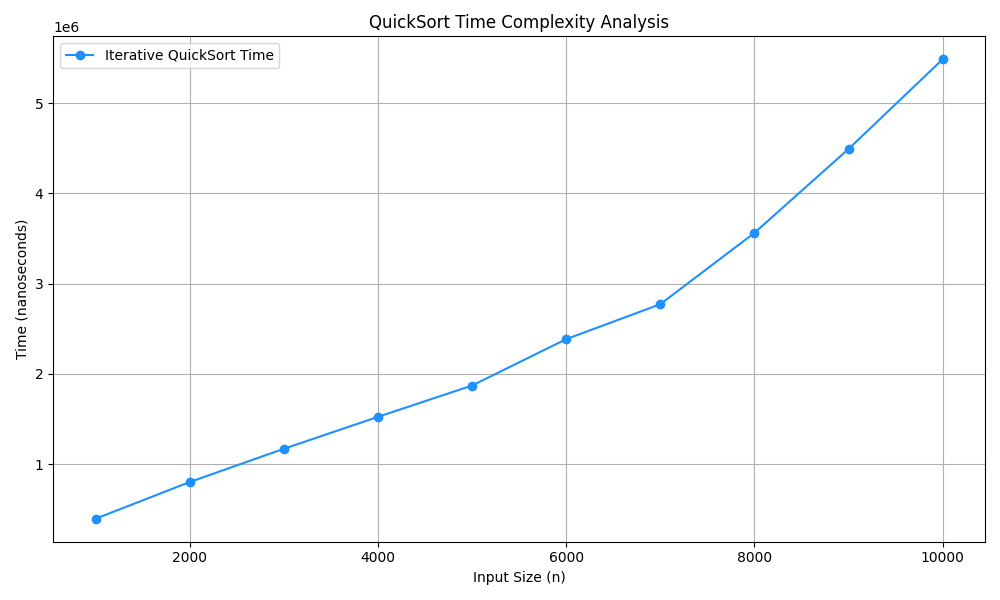

## Complexity Analysis of Selection Sort
### Time Complexity: O(n2) ,as there are two nested loops:

- One loop to select an element of Array one by one = O(n)
Another loop to compare that element with every other Array element = O(n)
- Therefore overall complexity = O(n) * O(n) = O(n*n) = O(n2)
Auxiliary Space: O(1) as the only extra memory used is for temporary variables.

## Complexity Analysis of iterative Quick sort method
### Time Complexity
- Average Case: O(n log n)
- Worst Case: O(n²) (if pivot is poorly chosen, e.g., already sorted array)

 

### Common Pitfall 
- Pivot Choice: Always choosing the last element can lead to worst-case behavior. Use median-of-three for optimization.

- Stack Management: Ensure you push subarrays in the correct order (e.g., process smaller subarrays first).

## Complexity Analysis of QuickSort method

### Time Complexity
- Best Case Time Complexity Analysis of Quick Sort: O(N * logN).
- Worst Case Time Complexity Analysis of Quick Sort: O(N2).
- Average Case Time Complexity Analysis of Quick Sort: O(N * logN).

## Complexity Analysis of MergeSort method

### Time Complexity
-  time complexity is O(N * log2N).
- best case, the worst case and the average case the time complexity is the same.

### Learnings

- in Selectionsort algorithm we are passing array to a function even it's not passed by reference ?
  - it decays into a pointer to its first element. This means:
   - Pass by Pointer (Not by Value):
     Even though the syntax int arr[] is used, the function receives a pointer (int* arr). Modifications to the array inside the   function directly affect the original array in main().

   - In-Place Sorting:
     The selection_sort function swaps elements in the original array (via the pointer), so the changes persist after the function call.
